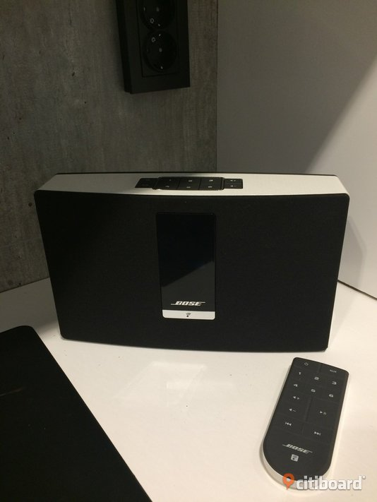
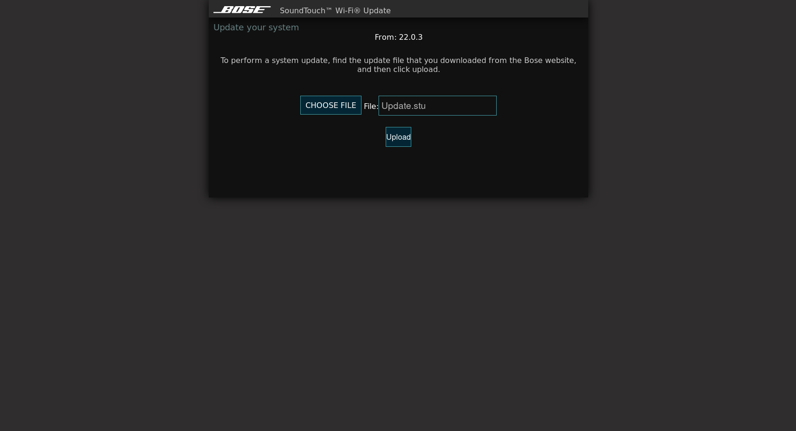
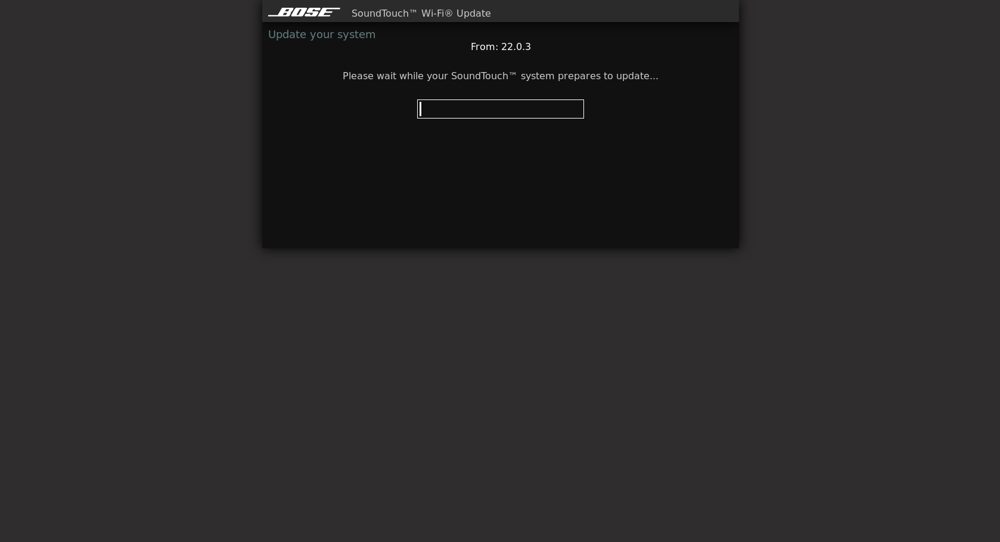
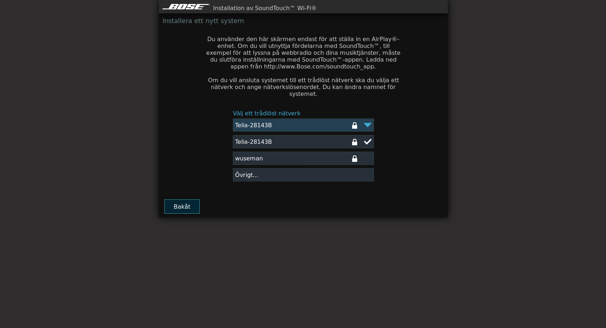

# BOSE SOUNDTOUCH

 
### 'Hackers can remotely control thousands of Sonos and Bose speakers'
##### 'Security experts at Trend Micro have demonstrated that certain models of Sonos and Bose speakers are affected by vulnerabilities that could allow attackers to hijack them.'

https://securityaffairs.co/wordpress/67292/hacking/hacking-speakers.html

## So how do we hack them? See below! :-)

#### While USB cable is plugged in browse to:

        http://203.0.113.1:17008/update.html

#### Choose your "Update.stu" file and hit upload - Upgrade will take ~3 minutes, once done browse to your bose soundtouch devices IP address and hit upload and the once done, do as below:
      

#### A simple portscan gives us the result below: (IMPORTANT: USB Cable must be plugged in)

      thinkpad /home/wuseman # nmap -p0- -T5 203.0.113.1
      Starting Nmap 7.80 ( https://nmap.org ) at 2019-10-27 03:54 CET
      Nmap scan report for 203.0.113.1
      Host is up (0.0066s latency).
      Not shown: 65515 closed ports
      PORT      STATE SERVICE
      82/tcp    open  xfer
      8080/tcp  open  http-proxy
      8090/tcp  open  opsmessaging
      8091/tcp  open  jamlink
      17000/tcp open  unknown
      17004/tcp open  unknown
      17005/tcp open  unknown
      17008/tcp open  unknown
      17018/tcp open  unknown
      30030/tcp open  unknown
      30031/tcp open  unknown
      40002/tcp open  unknown
      40003/tcp open  unknown
      40030/tcp open  unknown
      40031/tcp open  unknown
      44149/tcp open  unknown
      49240/tcp open  unknown
      49916/tcp open  unknown
      49935/tcp open  unknown
      57376/tcp open  unknown
      59994/tcp open  unknown
      MAC Address: B2:D1:XB:5E:87:65 (Unknown)

Nmap done: 1 IP address (1 host up) scanned in 4.13 seconds

#### So now we gonna try to connect to all ports and see if they are available to connect to

      wuseman@thinkpad ~ $ telnet 203.0.113.1 82
      Trying 203.0.113.1...
      Connected to 203.0.113.1.
      Escape character is '^]'.
      GET /index.html
      Connection closed by foreign host.

      wuseman@thinkpad ~ $ telnet 203.0.113.1 8080
      Trying 203.0.113.1...
      Connected to 203.0.113.1.
      Escape character is '^]'.
      get /update.html
      GET /index.html
      Connection closed by foreign host.

     Same result on 8090 and 8091, but on 17000 we got a shell, bingo!!

      wuseman@thinkpad ~ $ telnet 203.0.113.1 17000
      Trying 203.0.113.1...
      Connected to 203.0.113.1.
      Escape character is '^]'.
      ->
 
### A video while playing around with some commands

 

# CONTACT

If you have problems, questions, ideas or suggestions please contact me on wuseman@nr1.nu

# WEB SITE
Visit our homepage for the latest info and updated tools
https://github.com/wuseman

# END!
